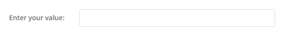

## EnterToAction
This widget is used as part of the Mendix Academy learning path: Build a Pluggable Widget.

## Features
The widget renders a textbox that features an event that it triggered when the user hits the `Enter` key. 

## Issues, suggestions and feature requests
https://github.com/cdcharlebois/academy-build-a-pluggable-widget/issues

## Development and contribution
Not actively accepting pull requests at this time.
